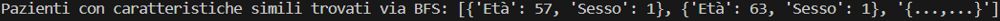

# Predizione delle Malattie Cardiache e Analisi Basata su Conoscenza

Questo progetto in Python esegue un'analisi approfondita sui dati relativi alle malattie cardiache e utilizza modelli di apprendimento supervisionato per la predizione. In particolare, vengono impiegati i modelli **Decision Tree** e **Random Forest** per la classificazione, e viene integrato un sistema basato su regole tramite Prolog per ottenere ulteriori informazioni (ad esempio, l'identificazione dei pazienti ad alto rischio). Inoltre, è implementato un algoritmo di ricerca in ampiezza (BFS) per trovare pazienti simili.

---

## Contenuto del Progetto

### 1. Data Exploration e Visualizzazione

Il programma inizia eseguendo una serie di analisi esplorative sul dataset, al fine di comprendere la distribuzione e le relazioni tra le variabili. In questa fase vengono visualizzati i seguenti grafici:

#### a) Istogrammi delle Variabili
- **Cosa mostra:**  
  Viene generata una figura contenente un istogramma per ciascuna variabile del dataset.  
- **Perché è utile:**  
  Gli istogrammi permettono di osservare la distribuzione (frequenza, forma, presenza di outlier) delle variabili numeriche. In questo modo, è possibile capire rapidamente la natura dei dati e identificare eventuali anomalie.
  
  


#### b) Grafico a Barre della Variabile Target
- **Cosa mostra:**  
  Un grafico a barre (countplot) che visualizza il numero di osservazioni per ciascuna classe della variabile target (ad esempio, presenza o assenza di malattia cardiaca).  
- **Perché è utile:**  
  Questo grafico consente di verificare se le classi sono bilanciate o sbilanciate, informazione importante per la scelta dei modelli di classificazione e per l'interpretazione dei risultati.

  

#### c) Heatmap della Matrice di Correlazione
- **Cosa mostra:**  
  Una heatmap che rappresenta la matrice di correlazione tra tutte le variabili del dataset. I valori sono annotati e colorati in base al grado di correlazione (con una scala cromatica 'RdYlGn').  
- **Perché è utile:**  
  La heatmap aiuta a identificare relazioni forti (positive o negative) tra le variabili. Queste informazioni possono essere utili per selezionare le caratteristiche più rilevanti e per comprendere meglio le dinamiche interne del dataset.

  

---

### 2. Pre-elaborazione dei Dati

- **Trasformazione delle variabili categoriche:**  
  Le variabili categoriche vengono convertite in variabili dummy (one-hot encoding) utilizzando `pd.get_dummies()`.
  
- **Standardizzazione:**  
  Le variabili numeriche vengono standardizzate utilizzando `StandardScaler` per ottenere valori con media 0 e deviazione standard 1.
  
- **Divisione del Dataset:**  
  Il dataset viene suddiviso in:
  - **X:** Variabili indipendenti (tutte le colonne eccetto il target).
  - **y:** Variabile dipendente (target).
  
- **Train-Test Split:**  
  I dati vengono ulteriormente divisi in set di training (80%) e test (20%) con `train_test_split` per addestrare e valutare i modelli.

---

### 3. Costruzione e Valutazione dei Modelli di Classificazione

#### Decision Tree
- **Validazione Incrociata:**  
  Viene eseguita la validazione incrociata a 10-fold per modelli Decision Tree con profondità variabile (da 1 a 10) per determinare la profondità ottimale.
  
- **Addestramento e Valutazione:**  
  Dopo aver analizzato i punteggi, viene addestrato un modello di Decision Tree con `max_depth=3` sui dati di training. Le prestazioni vengono poi valutate sul set di test calcolando metriche quali:
  - Accuracy
  - Precision
  - Recall
  - F1-score
  - ROC-AUC  
  Queste metriche vengono calcolate tramite una funzione dedicata `stampa_metriche`.

  

#### Random Forest
- **Validazione Incrociata:**  
  Viene eseguita la validazione incrociata a 5-fold per modelli Random Forest variando il numero di stimatori (da 10 a 100, a passi di 10) per individuare il numero ottimale.
  
- **Addestramento e Valutazione:**  
  Un modello Random Forest con `n_estimators=90` viene addestrato sui dati di training e le prestazioni vengono valutate sul set di test utilizzando le stesse metriche del Decision Tree.
  
  

---

### 4. Integrazione con Prolog per l'Analisi Basata su Regole

- **Consultazione e Query:**  
  Utilizzando il modulo `pyswip`, il programma carica il file `heart_rules.pl` (che include anche `heart_kb.pl`) e esegue diverse query per ottenere informazioni specifiche, quali:
  - Pazienti ad alto rischio (`alto_rischio`)
  - Pazienti con ipertensione o colesterolo alto (`ipertensione_colesterolo`)
  - Pazienti con anomalie all'ECG (`ecg_anomalo`)
  - Pazienti con angina da sforzo (`angina_sforzo`)
  - Pazienti con profilo ad alto rischio (`profilo_alto_rischio`)
  
  I risultati vengono troncati a un massimo di 3 elementi per una visualizzazione più compatta.

  
---

### 5. Algoritmo BFS per la Ricerca di Pazienti Simili

- **Implementazione della BFS:**  
  Viene implementato un algoritmo di ricerca in ampiezza (BFS) per trovare pazienti simili.  
- **Funzionamento:**  
  - Si parte da un paziente iniziale (definito da età e sesso).
  - La ricerca si espande in ampiezza fino a una profondità massima (default 3).
  - Vengono evitati duplicati tramite una struttura di controllo (insieme dei visitati).
  - Se il numero di risultati supera 3, viene aggiunto un segnaposto per indicare il troncamento.

  

---

## Requisiti

Il progetto richiede l'installazione delle seguenti librerie Python:
- numpy
- pandas
- matplotlib
- seaborn
- pyswip
- scikit-learn

Inoltre, è necessario avere i seguenti file nella struttura del progetto:
- `heart.csv` (dataset)
- `heart_rules.pl` (file Prolog contenente le regole, che include anche `heart_kb.pl`)

---

## Istruzioni per l'Esecuzione

1. **Installazione delle Dipendenze:**  
   Installa le librerie richieste, ad esempio con:
   ```bash
   pip install numpy pandas matplotlib seaborn pyswip scikit-learn
